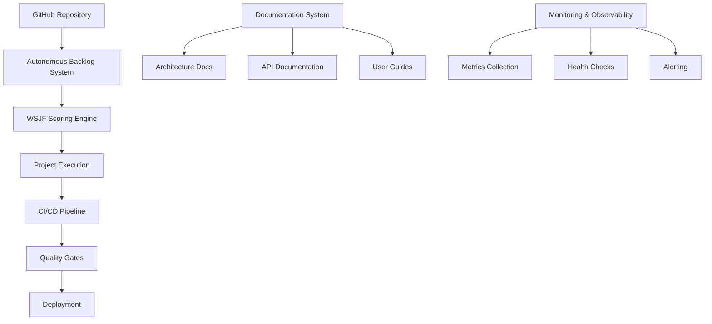

# Architecture Overview

## System Design

This repository serves as Daniel Schmidt's professional portfolio and project showcase, featuring a comprehensive SDLC implementation with autonomous backlog management.

### High-Level Architecture

### Component Overview

#### 1. Autonomous Backlog Management
- **Purpose**: Prioritize and execute work items using WSJF scoring
- **Location**: `backlog.yml`
- **Dependencies**: None
- **Interfaces**: YAML configuration, GitHub Issues integration

#### 2. Project Structure
- **Source Code**: `src/` - Main implementation
- **Tests**: `tests/` - Unit, integration, and E2E tests
- **Documentation**: `docs/` - Architecture, guides, and specifications
- **Configuration**: Root-level config files

#### 3. Quality Assurance
- **Testing Strategy**: TDD-first approach with comprehensive coverage
- **Code Quality**: Automated linting, formatting, and security scanning
- **Security**: Input validation, secure logging, dependency scanning

### Data Flow

1. **Issue Creation**: New work items added to backlog.yml
2. **WSJF Scoring**: Automatic prioritization based on value, urgency, and effort
3. **Execution**: Items moved through status pipeline (NEW → REFINED → READY → DOING → PR → DONE)
4. **Quality Gates**: Automated testing, security scanning, documentation updates
5. **Deployment**: Continuous integration and deployment pipeline

### Architecture Decisions

See `docs/adr/` for detailed Architecture Decision Records covering:
- Technology stack choices
- Security patterns
- Testing strategies
- Deployment approaches

### Security Considerations

- All inputs validated before processing
- Secrets managed through environment variables
- Dependency scanning for known vulnerabilities
- Secure coding practices enforced via linting
- Audit trail for all changes

### Performance & Scalability

- Lightweight backlog processing
- Efficient CI/CD pipeline execution
- Minimal resource requirements
- Horizontal scaling capability for future growth

### Monitoring & Observability

- Health check endpoints
- Structured logging
- Metrics collection (DORA metrics)
- Error tracking and alerting
- Performance monitoring

## Technology Stack

- **Languages**: Python, TypeScript, Rust (project-dependent)
- **CI/CD**: GitHub Actions
- **Documentation**: Markdown, Mermaid diagrams
- **Quality Tools**: ESLint, Prettier, pre-commit hooks
- **Security**: Cosign, SBOM generation, vulnerability scanning
- **Containerization**: Docker with multi-stage builds